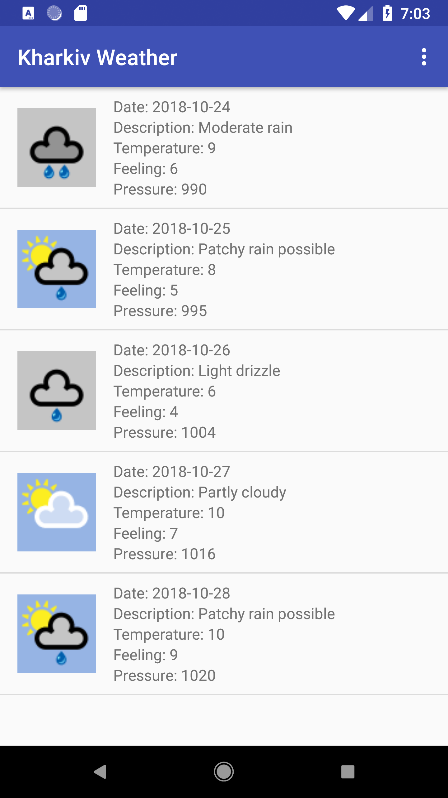
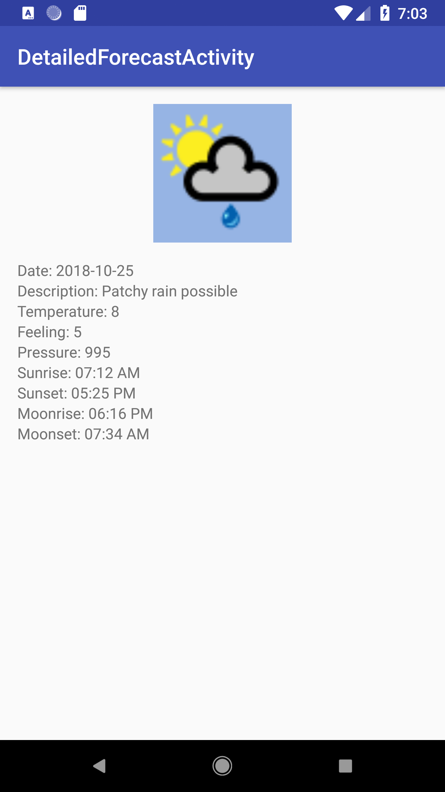

# WeatherMVP
Simple weather app "Kharkiv Weather" using pattern MVP and Retrofit2

## Libraries

* [Retrofit 2](https://square.github.io/retrofit/) for sending requestes for REST Api
* [ButterKnife](http://jakewharton.github.io/butterknife/) for clean code
* [Glide](https://github.com/bumptech/glide) for downloading and cashing images
